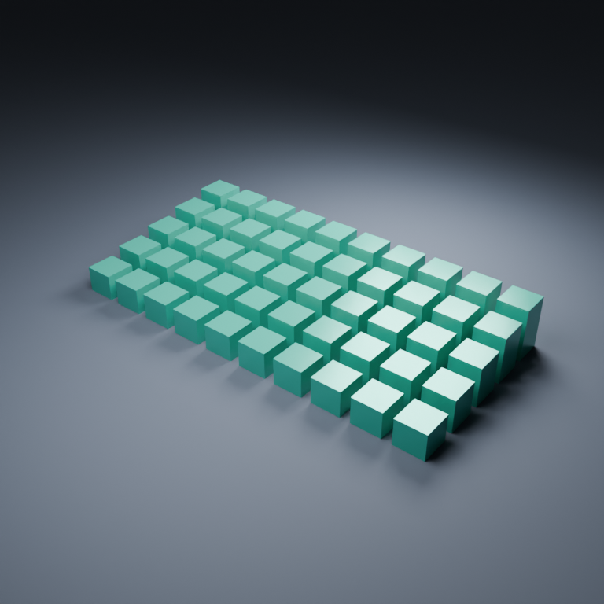

# Blender Compact MCP

Four tools for Blender: **inspect**, **discover**, **execute**, **capture**.
Batch related edits, fetch operation arguments only when needed, and return bounded summaries.



This is an early working release, tested on **Windows 11 with Blender 5.1.1**. Blender 4.2+
is the intended API target; other Blender versions and operating systems are not yet runtime-verified.
There is no hosted model, telemetry, model API key, or arbitrary Python execution endpoint.

## What works

- Cube, sphere, plane, cylinder and cone creation.
- Transforms, Principled materials and material assignment.
- Linked arrays: create up to 200 copies in one operation.
- Cameras, lights, camera rendering and `.blend` copy export.
- Four small MCP tools and a CLI using the same authenticated operation path.
- Independent write, render, delete and save permissions, fixed when the server starts.
- Editing restricted to objects/materials tagged by this add-on. Existing untagged objects can be inspected.
- Interactive Undo checkpoints for batches; partial runtime failures are explicit.

Geometry Nodes, animation, arbitrary scene editing, viewport captures and custom Python recipes are
**not implemented in v0.1**. `capture` renders the active camera, using Cycles at 16 samples,
then restores the temporary render settings. It blocks Blender while rendering.

## Quick start

Requirements: Blender, Python 3.11+ and [uv](https://docs.astral.sh/uv/).

1. Download `compact_blender-0.1.0.zip` from this repository's Releases.
2. In Blender, open **Edit → Preferences → Add-ons → Install from Disk**, choose the ZIP and enable
   **Compact Blender MCP**.
3. In the 3D Viewport sidebar (`N`), open **Compact MCP**. Review permissions and click **Start bridge**.
   Write and render default on; delete and save default off. Stop/restart to change permissions.
4. Clone this repository and run `uv sync --frozen` inside it.
5. Add the MCP command below to your client. Use an absolute path to your checkout:

```json
{
  "mcpServers": {
    "blender-compact": {
      "command": "uv",
      "args": ["run", "--directory", "/absolute/path/blender-compact-mcp", "blender-compact-mcp"]
    }
  }
}
```

If `uv` is not on the GUI application's PATH, set `command` to its absolute executable path.
Use the client's own MCP configuration format; the block above illustrates a common JSON form.
No token needs to be pasted into model context. The bridge reads the local descriptor.

For multiple Blender instances, set `BLENDER_COMPACT_CONNECTION` to the intended descriptor:
Windows `%LOCALAPPDATA%/blender-compact-mcp/connection-<pid>.json`;
Linux/macOS `${XDG_STATE_HOME:-~/.local/state}/blender-compact-mcp/connection-<pid>.json`.
Ambiguous discovery fails rather than picking an arbitrary scene. After a crash, remove only the
stale instance's descriptor. Normal shutdown removes it; opening a different file stops the server.

## Try it

First ask the agent to discover `primitive`, `array`, `material`, and `assign_material`, then:

> Create a teal cube named Demo at [0,0,1], then make 49 linked copies along X. Inspect the
> first and last object only. Do not render until I ask.

Or use the CLI:

```sh
uv run blender-compact discover
uv run blender-compact inspect
uv run blender-compact execute --params '{"steps":[{"op":"primitive","kind":"cube","name":"Demo","location":[0,0,1]},{"op":"array","name":"Demo","count":49,"offset":[2.5,0,0],"prefix":"Copy"}]}'
```

For PowerShell, avoid nested JSON quoting by piping a file:

```powershell
Get-Content -Raw examples/scene.json | uv run blender-compact execute --params -
```

That example creates 50 cubes, a floor, camera and lights in one batch. Names must be unique;
it intentionally refuses to overwrite existing objects. Run it in a fresh scene.

```sh
uv run blender-compact capture --params '{"filename":"preview.png","size":768}'
```

The CLI returns an output filename; MCP returns an image. Exports go under the local state
directory's `exports/` folder. A repeated filename is refused. Capture does not include other apps
or take a desktop screenshot. Save exports a **copy**, never overwrites a file, and requires save permission.

## Measured overhead, not marketing

In a real Blender test, the same 50 transforms produced identical final object properties:

| Protocol payload | 50 individual calls | One batch |
|---|---:|---:|
| Argument tokens | 1,149 | 1,002 |
| Result tokens | 800 | 16 |
| Total | 1,949 | 1,018 |

**47.77% fewer payload tokens**, using `cl100k_base`. Results are measured from actual requests and
responses, not guessed from characters. This isolates batching using our own bridge in both cases.
It excludes model reasoning, conversation history, caching, tool-call envelopes, images, setup and
discovery. It is **not a benchmark against another product and not a claim of 47.77% lower total bills**.
The agent's quality, task and client-side tool loading still matter. See [validation](docs/validation.md).

## Architecture

```text
AI client -- MCP stdio --> Python SDK bridge -- authenticated loopback JSON --> Blender add-on
CLI ----------------------------------------------^                        bpy.app.timers
```

Blender's timer accepts bounded socket input and executes operations on its main thread. No Python
background thread accesses Blender data. There are no shell or eval endpoints. `discover` returns
human-readable argument contracts; operations are validated again by the add-on before execution.
See [design](docs/design.md) and [security](SECURITY.md).

## Development and tests

```sh
uv sync --frozen
uv run ruff check --config pyproject.toml .
uv run ruff format --check --config pyproject.toml .
uv run pytest -q
uv run python scripts/package_addon.py
uv build
```

Without `BLENDER_EXE`, real Blender tests explicitly skip. Enable them on Windows:

```powershell
$env:BLENDER_EXE = 'D:/blender/blender.exe' # use your installed path
$env:BLENDER_TEST_UI = '1' # also check actual UI timer execution and Undo
uv run pytest -q
```

The tests launch **separate factory-startup processes**. They never connect to an already-open user
scene or save user preferences. Outputs and logs go to ignored `artifacts/`. The UI helper is hidden
on Windows and exits automatically. Linux UI tests require a display; background tests do not.

The package ZIP contains only the add-on's Python sources. The wheel contains the MCP bridge/CLI;
installing the wheel alone does not install the Blender add-on.

MIT licensed. Independent software, not affiliated with Blender or any model provider.
